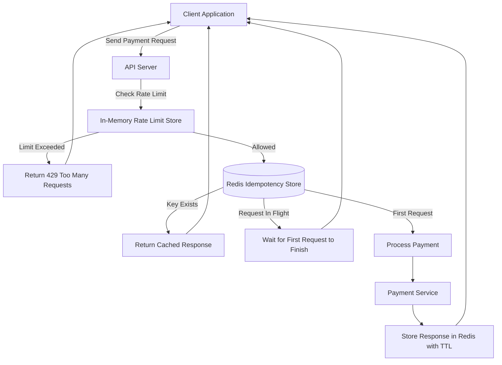

## Idempotency-Gateway (The "Pay-Once" Protocol)
About

This project implements an Idempotency Layer for payment processing, ensuring that a payment request is processed exactly once even if clients retry due to network issues.

The system is designed for FinSafe Transactions Ltd., solving the problem of double-charging caused by network retries in e-commerce transactions.

## Architecture Overview

The system introduces an Idempotency Gateway between clients and the payment service.

It ensures that repeated requests with the same Idempotency-Key are processed only once.

## Key responsibilities of the gateway

Validate idempotency keys

Detect duplicate requests

Prevent conflicting payloads

Handle concurrent in-flight requests

Cache responses using Redis

Protect the system with rate limiting

## Architecture Diagram

