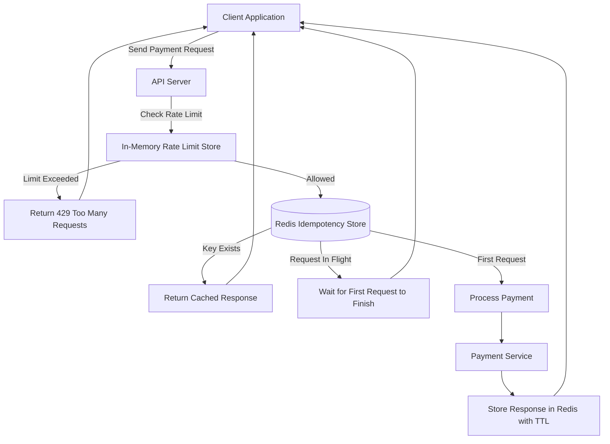
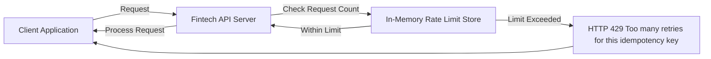

## Idempotency-Gateway (The "Pay-Once" Protocol)
About

This project implements an Idempotency Layer for payment processing, ensuring that a payment request is processed exactly once even if clients retry due to network issues.

The system is designed for FinSafe Transactions Ltd., solving the problem of double-charging caused by network retries in e-commerce transactions.

## Architecture Overview

The system introduces an Idempotency Gateway between clients and the payment service.

It ensures that repeated requests with the same Idempotency-Key are processed only once.

## Key responsibilities of the gateway

Validate idempotency keys

Detect duplicate requests

Prevent conflicting payloads

Handle concurrent in-flight requests

Cache responses using Redis

Protect the system with rate limiting

## Architecture Diagram


## Features
Idempotent Payment Processing

Ensures a payment request is processed exactly once per unique Idempotency-Key.

Duplicate Request Handling

Returns a cached response immediately without re-processing the payment.

Conflict Detection

Rejects requests that use the same idempotency key but a different payload.

Response: 409 Conflict.

Concurrent Request Handling (In-Flight Protection)

If multiple requests arrive simultaneously with the same key:

The first request processes the payment

Other requests wait

All receive the same final response

Redis TTL

Completed requests expire automatically after 24 hours, preventing database growth.

## Developer's Choice:
### 1. Rate Limiting
Feature Overview

Rate limiting controls how many requests a client can make within a specific time window.

In a Fintech system, rate limiting is important because repeated or automated requests could:

overload the API

attempt fraudulent transactions

abuse payment endpoints

This feature ensures system stability, fairness, and security.

Implementation Concept

Requests are tracked per client

Clients may be identified using:

API key

IP address

user ID

Limits can be configured (example: 100 requests per minute)

When the limit is exceeded, the API returns:

HTTP 429 Too many retries for this idempotency key

Redis is used as a high-performance in-memory counter for tracking requests.

## Architecture Diagram (Rate Limiting)


### Benefits

System Protection: Prevents denial-of-service (DoS) attacks or accidental overload from high-frequency requests.

Fair Usage: Ensures all users have equitable access to the API, avoiding a single client monopolizing resources.

Operational Stability: Maintains consistent performance and reliability under heavy traffic.

Security Enhancement: Helps mitigate abuse from automated scripts or bots attempting to perform repeated transactions.

### Why Added

In a real-world Fintech system, safeguarding API endpoints against abuse or spikes in traffic is critical. Rate limiting adds a protective layer that ensures system availability, user fairness, and operational safety. It complements idempotency by preventing repeated or malicious requests from affecting system integrity.

### 2. TTL for Redis Keys (24 hours)

### Reason

In a real production system, idempotency keys should not be stored forever.

Without expiration:
- Redis storage would continue to grow
- Old transactions would remain in memory indefinitely

Using a **24-hour TTL** ensures:
- Automatic cleanup of old keys
- Reduced memory usage
- Better long-term system stability

## Project Structure

idempotency-gateway
│
├── server.js
├── paymentService.js
├── idempotencyStore.js
│
├── middleware
│   └── idempotency.js
│
├── test
│   └── payment.http
│
└── README.md


## Setup Instructions

- **Clone the Repository**  
  - Run: `git clone https://github.com/Ernest-Asante/Idempotency-Gateway`  
  - Change directory: `cd idempotency-gateway`

- **Install Dependencies**  
  - Run: `npm install` to install all required packages

- **Create a `.env` File**
- Sign up on Redis cloud, create a database and get your variables
- https://redis.io/cloud/
  Add the following variables:  

REDIS_USERNAME= default

REDIS_PASSWORD= YOUR PASSWORD

REDIS_HOST= YOUR HOST

REDIS_PORT= YOUR PORT

PORT=3000 


- **Start the Server**  
- Run: `npm start` or `npm run dev` to launch the server

- **Access the Server**  
- Open in your browser or API client: `http://localhost:3000`

## API Documentation

### Process Payment

- **Endpoint**  
  `POST /process-payment`

- **Headers**  
  - `Idempotency-Key: <unique-key>`  
  - `Content-Type: application/json`

- **Request Body Example**  
  ```json
  {
    "amount": 100,
    "currency": "GHS",
    "user": "ernest"

  }

Responses

First Request (Happy Path)
```http

{
  "message": "Charged 100 GHS"
}

Status: 201 Created
```

Duplicate Request (Same Key and Body)
```http

{
  "message": "Charged 100 GHS"
}

Status: 201 Created

Header returned: X-Cache-Hit: true
```

Conflict Request (Same Key, Different Body)
```http

{
  "error": "Idempotency key already used for a different request body."
}

Status: 409 Conflict
```

Rate Limit Exceeded

```http

{
  "error": "Too many retries for this idempotency key"
}


Status: 429 Too Many Requests
```

## Design Decisions

### Redis for Idempotency Storage

Redis was chosen to store idempotency keys because it is very fast and supports automatic key expiration (TTL).

This allows the system to quickly check whether a request has already been processed and return a cached response without reprocessing the payment.

### Hashing the Request Body

The request body is hashed using SHA-256 before storing it with the idempotency key.

This helps the system detect when the same key is used with a different request payload.

If this happens, the API returns 409 Conflict to prevent incorrect or duplicate payments.

### In-Flight Request Protection

When multiple requests arrive at the same time with the same idempotency key, only the first request processes the payment.

Other requests wait until the first request finishes and then receive the same final response.

This prevents race conditions and double charging.

### Response Caching

After a payment is processed, the response is stored in Redis.

If the same request is retried with the same idempotency key and payload, the API returns the cached response instead of processing the payment again.

This ensures the same request always produces the same result.

### Rate Limiting

Rate limiting was added to prevent clients from sending too many requests in a short period of time.

If a client exceeds the allowed number of requests, the API returns HTTP 429 Too Many Requests.

This helps protect the system from abuse, retry loops, and API overload.

### TTL for Idempotency Keys

A 24-hour TTL is applied to idempotency keys stored in Redis.

This ensures that old keys are automatically deleted, preventing the database from growing indefinitely while still allowing retries within a reasonable time window.


## Testing

Example requests using **VS Code REST Client** or **Postman**.

- ### First Request — Happy Path
  ```http
  POST http://localhost:3000/process-payment
  Idempotency-Key: order124
  Content-Type: application/json

  {
    "amount": 100,
    "currency": "GHS",
    "user": "ernest"

  }

### Second Request — Retry with Same Key
```http
POST http://localhost:3000/process-payment
Idempotency-Key: order124
Content-Type: application/json

{
  "amount": 100,
  "currency": "GHS",
  "user": "ernest"

}
```
Expected behavior:

No new payment is processed

Cached response is returned

### Third Request — Conflict Case

```http
POST http://localhost:3000/process-payment
Idempotency-Key: order124
Content-Type: application/json

{
  "amount": 500,
  "currency": "GHS",
  "user": "ernest"

}
```

Expected response:

409 Conflict
